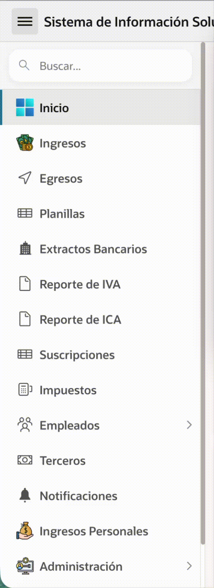

> *Para la documentación en español, haz clic [aquí](README.es.md).*

---
# APEX Side Navigation Smart Search 🔍

A dynamic, high-performance search bar for the Oracle APEX Side Navigation Menu. It allows users to filter navigation items in real-time without modifying the Universal Theme templates.

## 🚀 Features

* **Zero-Config Injection:** Automatically injects the search input into the DOM (no User Interface templates changes required).
* **Real-time Filtering:** Filters menu items instantly as you type.
* **Auto-Expand:** Automatically expands parent tree nodes when a child item matches the search term.
* **Native Look & Feel:** Inherits styles from the Universal Theme to look like a core component.
* **Keyboard Support:** `Esc` to clear search and collapse the menu.

## 📋 Requirements

* **Oracle APEX 20.2** or later.
* **Universal Theme (Theme 42)**.

## 📦 Installation

1.  Download the latest `dynamic_action_plugin_com_hardsoftsas_menu_search.sql`.
2.  Log in to your Oracle APEX Workspace.
3.  Go to **App Builder > Your Application > Shared Components > Plug-ins**.
4.  Click **Import** and select the `.sql` file.
5.  Follow the wizard steps to complete the installation.

## ⚙️ Usage

To activate the search bar globally in your application:

1.  Go to **Page 0 (Global Page)**.
2.  Create a new **Dynamic Action**.
    * **Name:** `Global - Menu Search`
    * **Event:** `Page Load`
3.  In the **True** action:
    * **Action:** `APEX Side Navigation Smart Search` (Plugin).
4.  Save and Run your application.

## 🤝 Contributing

Issues and Pull Requests are welcome. This project is intended to be a safe, welcoming space for collaboration.

## 📄 License

[MIT](LICENSE)

## Demo
[https://oracleapex.com/ords/r/hussein/apex-side-navigation-smart-search/home?session=115483674139892]

